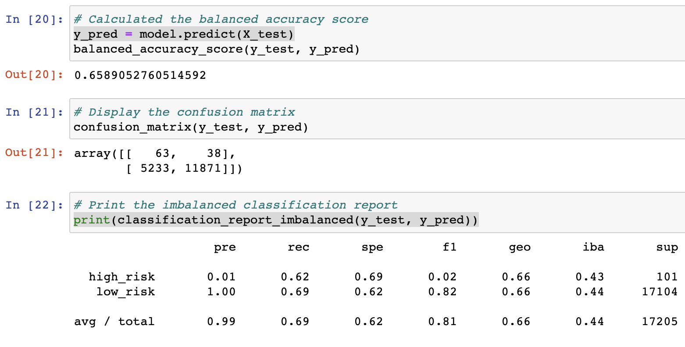
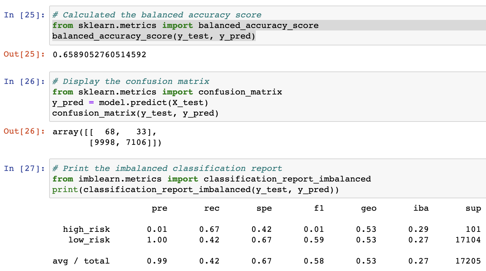
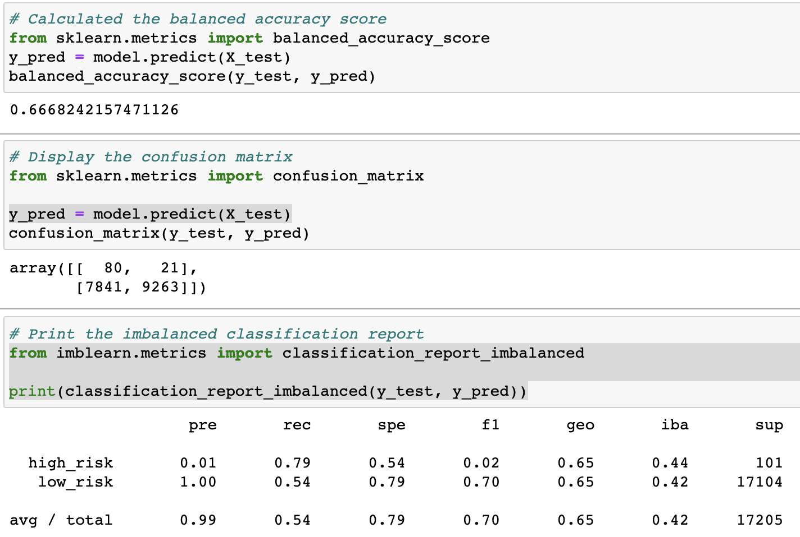

# Credit_Risk_Analysis

# Overview of the Credit Risk Analysis

- The purpose of this analysis was utilizing all the data preparation, statistical reasoning, and machine learning skills learned in the module and applying it towards a real-world case of determining credit card risk. Using the credit card risk data set, algorithms such as RandomOverSampler and SMOTE were utilized to oversample the data. Undersampling was also achieved using the ClusterCentroids algorithm. Even a combination of over and undersampling methods were used via the SMOTEEN algorithm. Additionally, BalancedRandomForestClassifier and EasyEnsembleClassifier were introduced and used to allow machine learning to work its magic to predict credit risk. 

# Results

**Naive Random Oversamping Results**

- Using the Naive Random Oversampling algorithm, the image above shows this algorithm producing an accuracy score of about 64%.
- The metrics of high risk precision was extremely low at .01 and the recall at a low .66. Low Risk precision was a perfect 1.0, but the recall was at a low .61.

**Synthetic Minority Oversampling Technique (SMOTE) Results**

- Using the SMOTE algorithm, the image above shows a slightly better accuracy score of about 66%.
- The metrics of high risk precision remained the same at .01 but the recall decreased to .62. Likewise, the low risk precision remained the same at 1.0 but the recall slightly improved to .69.

**Cluster Centroid Undersampling**

- Using the cluster centroid undersampling algorithm, the image above shows that the accuracy score was at about 66%.
- The metrics of high risk precision continued its .01 result, but the recall saw a result of .67. Meanwhile, the low risk precision was its continued 1.0, but the recall was at an abysmal .42.

**Combination Sampling**

- Using the SMOTEENN algorithm for combination sampling, the image above shows that the accuracy score was at about 67%.
- The metrics of high risk precision didn't change as it remained at .01, but the recall dropped further down to .79. As with the metric for low risk, precision remained the same at 1.0, but recall dropped greatly down to .54.

