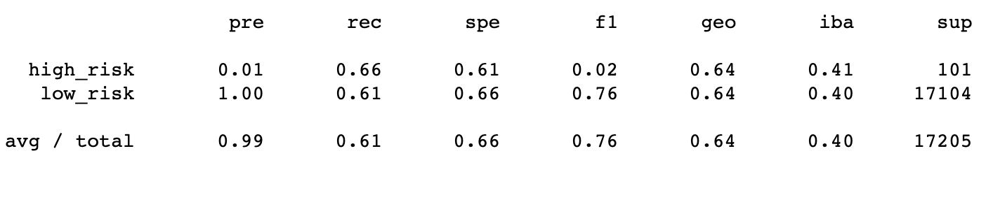
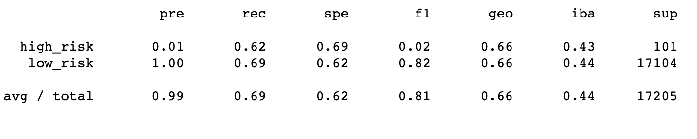
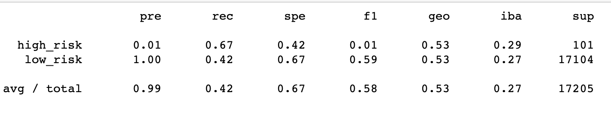
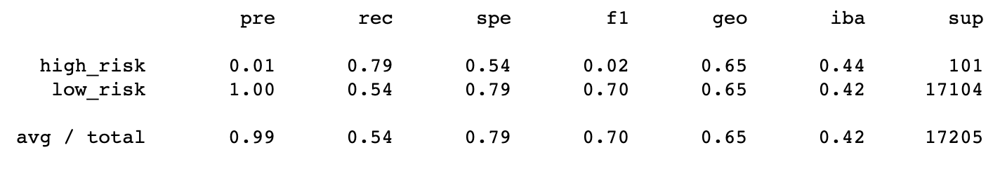
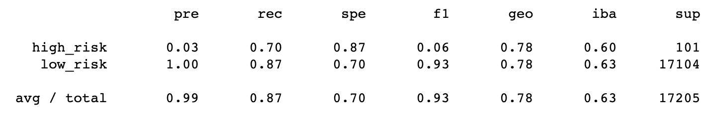
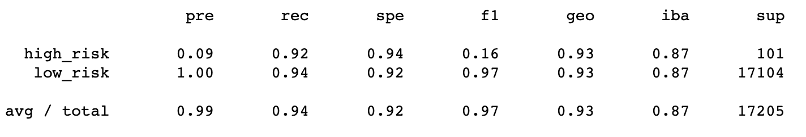

# Credit_Risk_Analysis

# Overview of the Credit Risk Analysis

- The purpose of this analysis was utilizing all the data preparation, statistical reasoning, and machine learning skills learned in the module and applying it towards a real-world case of determining credit card risk. Using the credit card risk data set, algorithms such as RandomOverSampler and SMOTE were utilized to oversample the data. Undersampling was also achieved using the ClusterCentroids algorithm. Even a combination of over and undersampling methods were used via the SMOTEEN algorithm. Additionally, BalancedRandomForestClassifier and EasyEnsembleClassifier were introduced and used to allow machine learning to work its magic to predict credit risk. 

# Results

**Naive Random Oversamping Results**

- Using the Naive Random Oversampling algorithm, the image above shows this algorithm producing an accuracy score of about 64%.
- The metrics of high risk precision was extremely low at .01 and the recall at a low .66. Low Risk precision was a perfect 1.0, but the recall was at a low .61.

**Synthetic Minority Oversampling Technique (SMOTE) Results**

- Using the SMOTE algorithm, the image above shows a slightly better accuracy score of about 66% using this algorithm.
- The metrics of high risk precision remained the same at .01 but the recall decreased to .62. Likewise, the low risk precision remained the same at 1.0 but the recall slightly improved to .69.

**Cluster Centroid Undersampling**

- Using the cluster centroid undersampling algorithm, the image above shows that the accuracy score using this algorithm was at about 66%.
- The metrics of high risk precision continued its .01 result, but the recall saw a result of .67. Meanwhile, the low risk precision was its continued 1.0, but the recall was at an abysmal .42.

**Combination Sampling**

- Using the SMOTEENN algorithm for combination sampling, the image above shows that the accuracy score using this algorithm was at about 67%.
- The metrics of high risk precision didn't change as it remained at .01, but the recall dropped further down to .79. As with the metric for low risk, precision remained the same at 1.0, but recall dropped greatly down to .54.

**Balanced Forest Random Classifier**

- Using the ensemble algorithm, Balanced Forest Random Classifier, the image above show that this algorithm produced an accuracy score of about 79%/
- The metrics of high risk for precision was at .03 and the recall was at .70. Metrics for low risk precision was at 1.0 and recall was at .87.

**AdaBoost Classifier**

- Using the easy ensemble algorithm, AdaBoost Classifier, the image above shows that this algorithm produced an accuracy score of about 93%.
- The metrics of high risk precision was at .09 while the recall was at .92. The metrics for low risk precision was at 1.00 and the recall was at .94.

# Summary

- The results of the machine learning models, shown in the results section, showcase a myriad of machine learning algorithm's calculations. Machine learning takes the dataset that is given and utilizes various functions in different alogorithms to help provide users answers to what they are searching for. In this case, it is credit card risk and whether the machine learning algorithm used can efficiently calculate and provide an accurate deduction of a dataset full of credit card users being a high risk or low risk. With regards to the Oversampling algorithm (using RandomOverSampler & SMOTE), undersampling algorithm(using ClusterCentroids), and combination of sampling algorithm (Using SMOTEENN), the data result most accurrate of the three noted was the Combination Sampling at 67% accuracy. Metric results wise, the results varied and procuded no clear efficient candidate worth deciding over as "best" to use in a given situation. While resampling and combining sampling can attempt to address imbalance, it does not gurantee better results. Things start to get interesting when using the machine learning models that reduced bias via the BalancedRandomForestsClassifier and EasyEnsembleClassifier. Both machine learning algorithms produced a passable 79% and 93% accuracy result, respectively. The metrics for both algorithms while not presteem, were slightlty better than the counterparts preceeding them. Ultimately, the recommendation to be made for which algorithm to use in the end will have to be the EasyEnsembleClassifer as it produced the highest accuracy rate and its metrics are reliable enough in regards to precision and recall. Modeling can be skewed simply by adjusting the n_estimators and random_State. A small tweak could compromise and produce a whole new set of results. Thus being careful and diligent in understanding modeling as being an iterative process that may require more data, more cleaning, another model parameter, or a different model, can be the difference in deciding which model to be used in appropriately determining the answers needed. 

